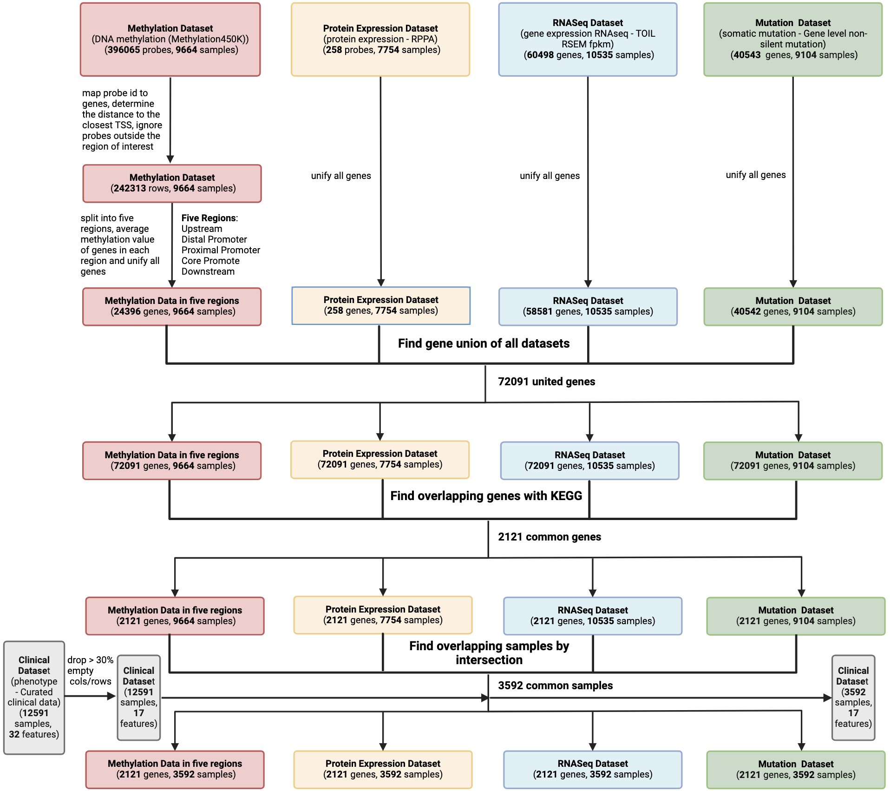
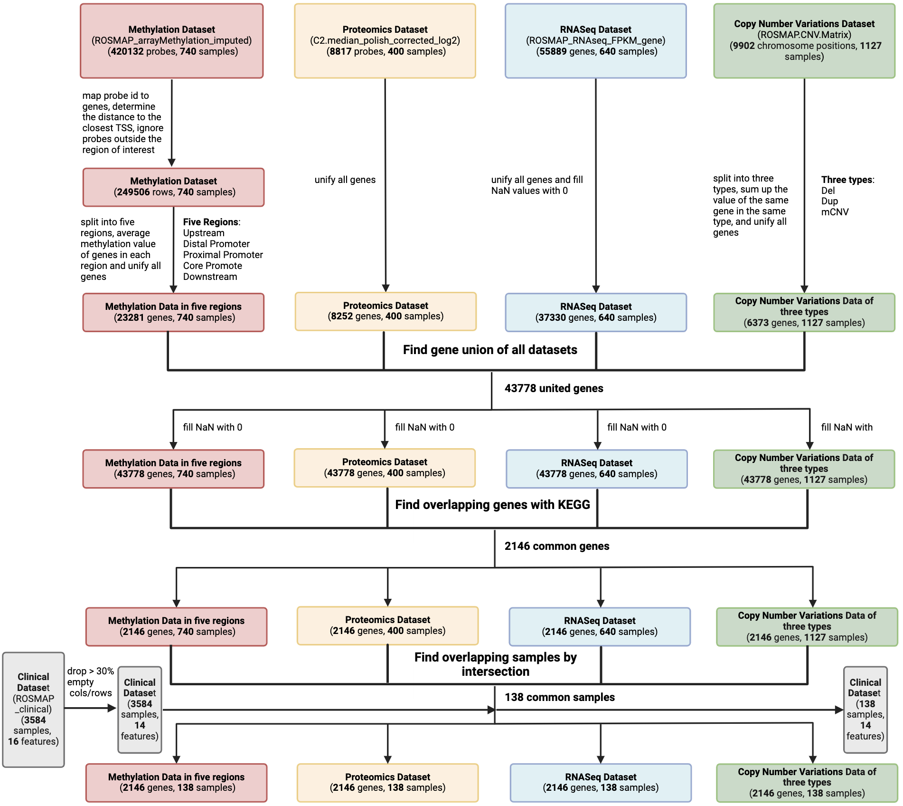
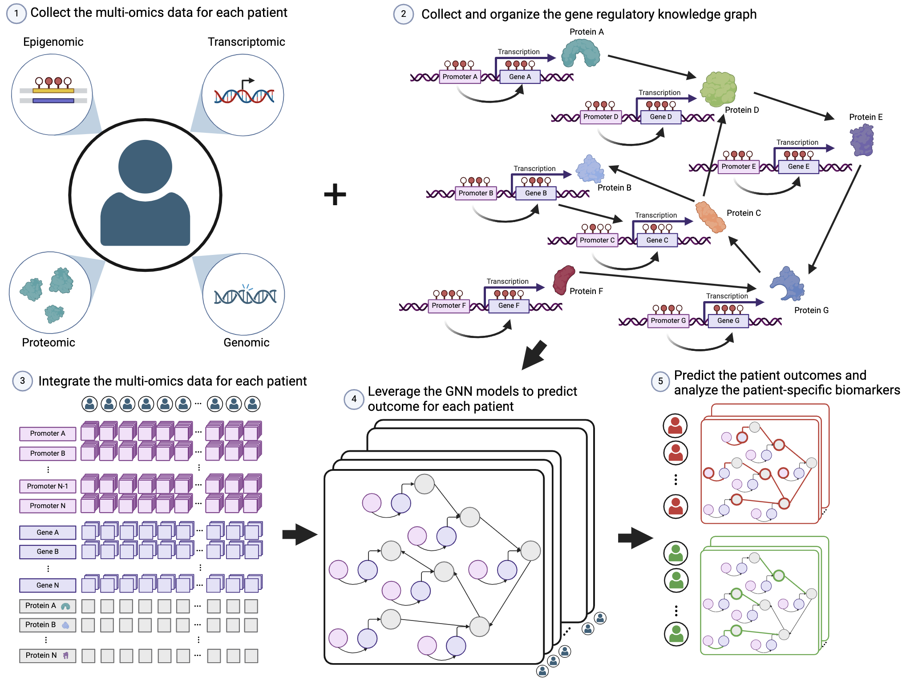
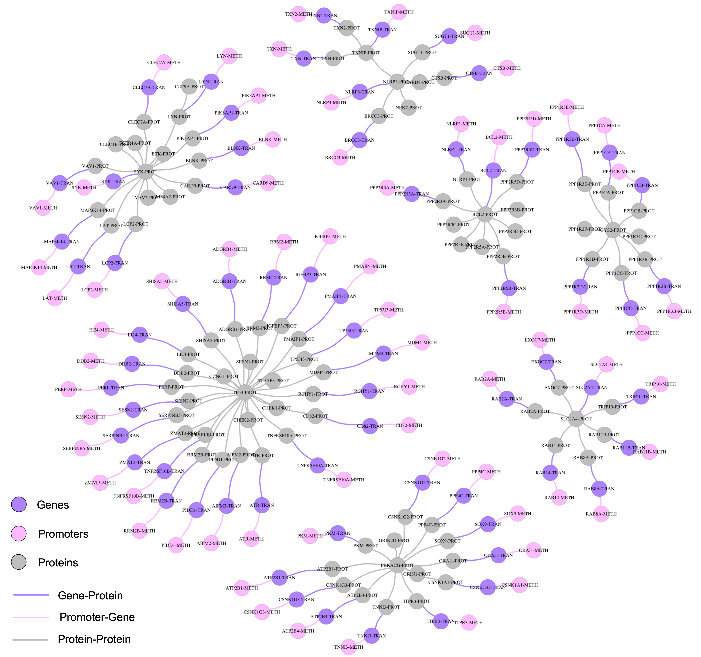

# mosGraphGen

## 1. UCSC Dataset Processing
* Parse the data from the UCSC Xena website in PANCAN cohort:
https://xenabrowser.net/datapages/?cohort=TCGA%20Pan-Cancer%20(PANCAN)&removeHub=https%3A%2F%2Fxena.treehouse.gi.ucsc.edu%3A443

* Copy number - somatic mutation (SNP and INDEL) - Gene level non-silent mutation
    * Dataset: https://xenabrowser.net/datapages/?dataset=mc3.v0.2.8.PUBLIC.nonsilentGene.xena&host=https%3A%2F%2Fpancanatlas.xenahubs.net&removeHub=https%3A%2F%2Fxena.treehouse.gi.ucsc.edu%3A443

* DNA methylation (Methylation450K)
    * Dataset: https://xenabrowser.net/datapages/?dataset=jhu-usc.edu_PANCAN_HumanMethylation450.betaValue_whitelisted.tsv.synapse_download_5096262.xena&host=https%3A%2F%2Fpancanatlas.xenahubs.net&removeHub=https%3A%2F%2Fxena.treehouse.gi.ucsc.edu%3A443
    * ID Map: https://www.ncbi.nlm.nih.gov/geo/query/acc.cgi?acc=GPL16304

* Gene expression RNAseq - TOIL RSEM fpkm
    * Dataset: https://xenabrowser.net/datapages/?dataset=tcga_RSEM_gene_fpkm&host=https%3A%2F%2Ftoil.xenahubs.net&removeHub=https%3A%2F%2Fxena.treehouse.gi.ucsc.edu%3A443
    
* Protein expression - RPPA
    * Dataset: https://xenabrowser.net/datapages/?dataset=TCGA-RPPA-pancan-clean.xena&host=https%3A%2F%2Fpancanatlas.xenahubs.net&removeHub=https%3A%2F%2Fxena.treehouse.gi.ucsc.edu%3A443

* Phenotype - Curated clinical data
    * Dataset: https://xenabrowser.net/datapages/?dataset=Survival_SupplementalTable_S1_20171025_xena_sp&host=https%3A%2F%2Fpancanatlas.xenahubs.net&removeHub=https%3A%2F%2Fxena.treehouse.gi.ucsc.edu%3A443


Check the jupyter nodebook 'UCSC_union_raw_data_process.ipynb' for details.
<!--  -->

## 2. ROSMAP Dataset Processing
* parse the multiomics data from the synapse website of the dataset ROSMAP https://www.synapse.org/#!Synapse:syn23446022
* Genome Variants https://www.synapse.org/#!Synapse:syn26263118
* Methylation https://www.synapse.org/#!Synapse:syn3168763
* RNA sequence https://www.synapse.org/#!Synapse:syn3505720
* Proteomics https://www.synapse.org/#!Synapse:syn21266454    

* parse the clinical data https://www.synapse.org/#!Synapse:syn3191087

Check the jupyter nodebook 'ROSMAP_union_raw_data_process.ipynb' for details.
<!--  -->

## 3. Run the Graph Neural Network Model


### 3.1 Load the data into NumPy format
change the dataset arguments if different dataset will be selected to run the experiments.
```bash
python load_data.py --dataset 'UCSC'
```

### 3.2 Run experiments on UCSC dataset
Select the fold_number to run individual split of the dataset. Numbers ranging from 1 to 5 here are allowed since the 5-fold cross validation is used.
```bash
python geo_UCSC_tmain_gcn.py --fold_number 1
```

```bash
python geo_UCSC_tmain_gat.py --fold_number 1
```

```bash
python geo_UCSC_tmain_gin.py --fold_number 1
```

```bash
python python geo_UCSC_tmain_gfomrer.py --fold_number 1
```

### 3.3 Run experiments on ROSMAP dataset
```bash
python geo_ROSMAP_tmain_gcn.py --fold_number 1
```

```bash
python geo_ROSMAP_tmain_gat.py --fold_number 1
```

```bash
python geo_ROSMAP_tmain_gin.py --fold_number 1
```

```bash
python geo_ROSMAP_tmain_gformer.py --fold_number 1
```

## 4. Downstream analysis for with patient specific biomarkers discovery
The R programing language will be used here to visualize the result in the file 'UCSC_gformer_vis.R', with the attention mechanism in model GraphFormer.

Following is an patient-specific biomaker discovery analysis exmaple. For patient TCGA-D7-6525-01

